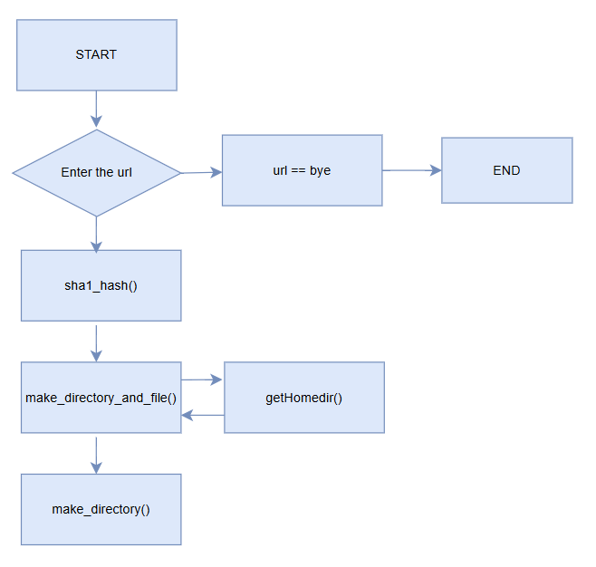
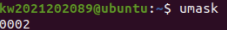
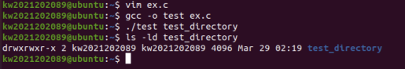
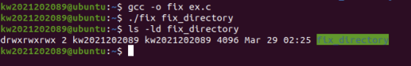
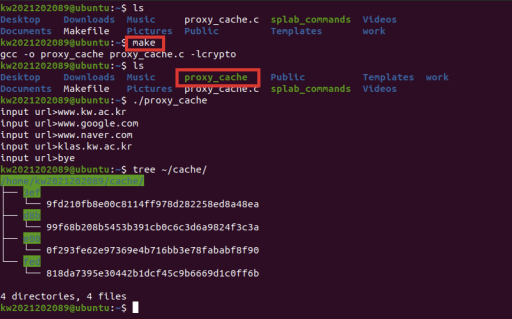

## 1. Introduction
본 프로젝트는 리눅스 환경에서 Proxy Cache 시스템의 기초가 되는 파일 시스템 관리 로직 구현을 목표로 하며, 주요 기능은 다음과 같습니다.

1 ) 프로세스 권한 제어 및 마스킹 해제 
- umask(0) 설정을 통해 시스템의 기본 권한 제한(Masking)을 제어합니다.
- 이를 통해 mkdir 시스템 콜 호출 시 사용자가 의도한 명시적 권한 (ex : 0777) 을 디렉토리에 정확히 부여하여 권한 충돌 문제를 해결합니다.

2 ) 해시 기반의 계층적 데이터 저장 구조
- 데이터 고유성 확보 : 입력받은 URL을 SHA-1 알고리즘으로 해싱하여 고유한 Digest를 생성합니다.
- 효율적 경로 관리 : 40자리의 해시값 중 앞 3글자를 디렉토리명으로, 나머지를 파일명으로 사용하는 계층적 구조를 설계하여 대용량 캐시 데이터의 검색 및 관리 효율을 높입니다.

---

## 2. Flow chart



---

## 3. Pseudo code

make_directory()
1. 경로(path)를 받아서 temp 배열에 저장한다.
2. 경로의 길이를 계산한다.
3. 경로의 마지막에 '/'가 있으면 제거한다.
4. temp 배열을 처음부터 끝까지 반복하면서:
 -> / 를 만나면, 그 지점에서 temp 문자열을 끊어 중간 디렉토리를 만든다.
 -> 중간 디렉토리를 만든 후, 다시 /를 복구하여 원래 경로를 유지한다.
5. 모든 중간 디렉토리를 만든 후, 최종 디렉토리를 만든다.

make_directory_and_file()
1. home 디렉토리를 가져온다.
2. home 디렉토리에 /cache를 추가하여 기본 캐시 디렉토리 경로를 만든다.
3. 해시된 URL의 첫 번째, 두 번째, 세 번째 문자를 기반으로 하위 디렉토리 경로를 만든다.
4. 해당 디렉토리가 존재하지 않으면:
 -> make_directory() 함수를 사용하여 디렉토리를 만든다.
5. 해시된 URL의 나머지 부분을 사용하여 파일 경로를 만든다.
6. 해당 파일이 존재하지 않으면:
 a. fopen()을 사용하여 새 파일을 생성하고, 생성된 파일을 닫는다.

main()
1. URL입력 (bye 입력시 종료)
2. sha1_hash(url,hashed_url)함수를 통해 hashed_url을 얻습니다.
3. make_directory_and_file(hashed_url) 함수를 통해 hashed_url로 구성된 디렉토리 및 파일을 생성합니다.

---

## 4. Result

**1 ) mkdir() 호출 시 권한 불일치 문제 분석**

```
#include <stdio.h>
#include <sys/types.h>
#include <sys/stat.h>
void main(int argc, char *argv[])
{
    if(argc < 2){
        printf(“error\n”);
        return;
    }
    mkdir(argv[1], S_IRWXU | S_IRWXG | S_IRWXO);
}

```

<br>

**문제 현상**

제시된 코드에서 mkdir의 인자로 모든 권한 (argv[1], S_IRWXU | S_IRWXG | S_IRWXO)을 부여했음에도 불구하고, 실제 생성된 디렉토리의 권한은 0775로 설정되는 현상이 발생합니다.


<br>

**발생 원인 : umask의 영향**





리눅스 시스템은 보안을 위해 새로 생성되는 파일이나 디렉토리의 권한을 제한하는 umask 값을 운용합니다.

- **원리:** 실제 권한은 (사용자가 설정한 권한) & ~(umask 값) 의 연산을 통해 결정됩니다.

- **현재 상태:** 현재 시스템의 기본 umask는 0002로 설정되어 있습니다.

- **계산:** 0777-0002 = 0775로 other 사용자의 쓰기 권한이 제한된 것입니다.

<br>

**해결 방법: 프로세스 레벨의 umask 해제**

umask(0) 함수를 호출하여 현재 프로세스가 생성하는 파일에 대해 시스템 마스킹을 무력화함으로써, 의도된 권한인 0777을 부여할 수 있습니다.
```
#include <stdio.h>
#include <sys/types.h>
#include <sys/stat.h>
void main(int argc, char *argv[])
{
    if(argc < 2){
        printf(“error\n”);
        return;
    }
    umask(0);   // 0002 -> 0000
    mkdir(argv[1], S_IRWXU | S_IRWXG | S_IRWXO); // 0777-0000 = 0777
}

```

<br>



-> 처음에 의도된 0777로 권한이 설정되었습니다.

---

<br>

**2 ) URL 계층적 캐시 저장 시스템 구축**

**실행 및 검증 프로세스**

본 프로젝트는 입력받은 URL을 해싱하여 파일 시스템 내에 체계적으로 구조화합니다.

a. **빌드 및 실행:** Makefile을 통해 소스 코드(proxy_cache.c)를 컴파일하고, 생성된 실행 파일을 구동합니다.

b. **데이터 입력:** 테스트 케이스로 www.kw.ac.kr, www.google.com 등의 URL을 입력합니다.

c. **해싱 및 경로 생성:** 입력된 URL은 SHA-1 알고리즘을 통해 40자리의 16진수 문자열로 변환됩니다.

d. **계층적 구조 저장:**
    - Root : home/kw2021202089/cache/
    - Directory: 해시값의 앞 3글자를 추출하여 하위 디렉토리를 생성합니다.
    - File: 나머지 해시 문자열을 파일명으로 사용하여 최종 데이터를 저장합니다.

**최종 결과 확인**

tree 명령어 실행 결과, 각 URL에 대응하는 고유한 해시 경로가 생성되었으며, 
총 4 directories, 4 files 가 정상적으로 구축되었음을 확인하였습니다.




---

## 5. Discussion

💡 **리눅스 파일 시스템 권한 체계의 이해와 최적화:**

- 프로젝트 초기, mkdir() 시스템 콜에 명시적인 권한(0777)을 부여했음에도 불구하고 실제 디렉토리가 0775로 생성되는 현상을 확인했습니다. 이를 통해 리눅스 커널이 파일 생성 시 보안을 위해 운용하는 umask 메커니즘을 심도 있게 분석하는 계기가 되었습니다. 프로세스 레벨에서 umask(0)를 호출하여 시스템 마스크를 일시적으로 해제함으로써, 설계 의도에 부합하는 정밀한 권한 제어를 구현할 수 있었습니다.

🛠 **Makefile을 통한 빌드 자동화 및 환경 적응:**

- CLI 환경과 vi 에디터 기반의 개발 프로세스에 적응하며 빌드 자동화의 중요성을 체감했습니다. Makefile이 단순한 컴파일 스크립트를 넘어 프로젝트의 의존성을 관리하고 개발 효율성을 극대화하는 도구임을 학습했습니다. 컴파일부터 실행 파일 생성까지의 워크플로우를 규격화함으로써, 협업 및 배포 환경에서도 동일한 빌드 결과를 보장할 수 있는 역량을 길렀습니다.

🔢 **데이터 인코딩: 바이너리 다이제스트의 문자열 시각화:**

- SHA-1 알고리즘이 생성하는 160-bit(20-byte) 바이너리 다이제스트를 파일 시스템 경로로 활용하기 위해 Hexadecimal Encoding 과정을 설계했습니다.

- sha1_hash() 핵심 원리: 1바이트(8비트)의 이진 데이터는 4비트씩 쪼개져서 두 자리의 16진수 문자가 됩니다. 그래서 결과값이 20바이트에서 40글자로 늘어나는 것입니다.

- 기술적 판단: 1바이트(8-bit)의 데이터를 2자리의 16진수 문자로 표현하여 가독성과 시스템 호환성을 확보했습니다.

- 메모리 설계: 이에 따라 결과 버퍼를 40-byte(데이터) + 1-byte(NULL 종료 문자)로 정밀하게 할당하여 메모리 오버플로우를 방지했습니다.

---

## 7. Reference

- [리눅스 umask 설정 및 권한 이해](https://m.blog.naver.com/doctor-kick/222059747063)