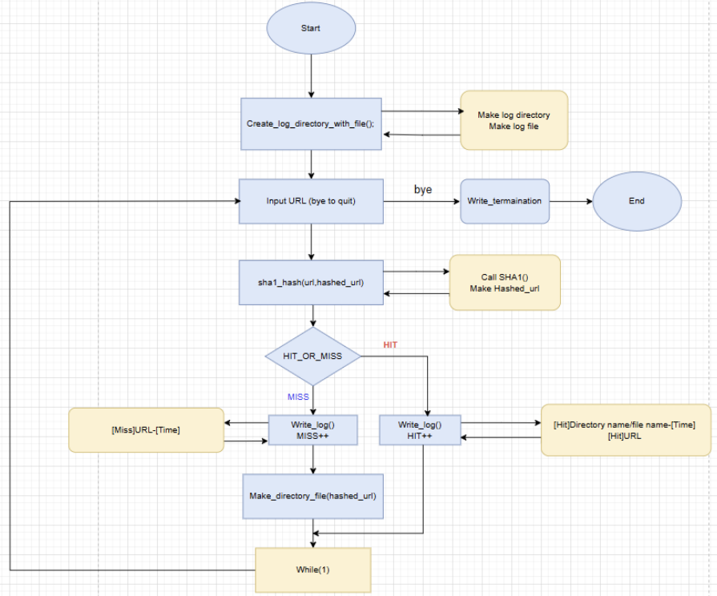
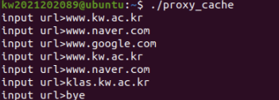
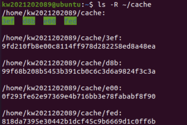
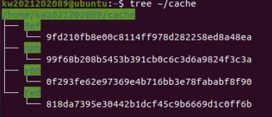
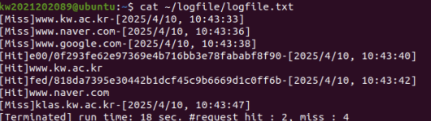

## 1. Introduction

**구현된 Proxy 1-1에 Proxy 1-2를 구현**
- Create a Directory and Log text File
- Directory path : ~/logfile
- logfile.txt path : ~/logfile/logfile.txt 

---

**logfile.txt format**
- Hit일 경우
    - [Hit]Directory name/file name-[Time] ( Time은 year/month/day, hour:min:sec 으로 표기 )
    - [Hit]URL (URL은 입력한 URL)

- Miss일 경우
    - [Miss]URL-[Time]

---

**프로그램 실행 시간 , 요청 횟수를 프로그램이 종료될 때 기록**
- Time()를 사용하여 프로그램 실행시간을 기록
- Request 횟수 : 프로그램이 종료 될 때 까지의 Hit과 miss의 횟수 기록
    - [Terminated] run time: 7 sec. #request hit : 2, miss : 3

---

## 2. Flow chart

---

## 3. Pseudo code

a. 프로그램 시작 시간 저장

b. 반복:
 - URL 입력 받기 (입력이 "bye"이면 반복 종료)
 - sha1_hash(url, hashed_url) 호출 → URL을 해시된 문자열로 변환
 - HIT_OR_MISS(hashed_url) 호출 → 결과를 result 변수에 저장
 - 만약 result == 1 (HIT):
    - hit 카운트 증가
    - write_log_in_file("Hit", url, hashed_url) 호출 → HIT 로그 작성
 - 아니면 (MISS):
    - miss 카운트 증가
    - write_log_in_file("Miss", url, NULL) 호출 → MISS 로그 작성
    - Make_directory_file(hashed_url) 호출 → 디렉토리 및 파일 생성

c. 프로그램 종료 시간 저장

d. write_termination() 호출 → 실행 시간, hit/miss 횟수 로그 작성

e. 프로그램 종료

---

## 4. Result

1 ) 테스트 케이스 입력

2 ) ls -R ~/cache 

3 ) tree ~ cache

4 ) cat ~/logfile/logfile.txt

---

## 5. Discussion

**핵심 요약 및 트러블슈팅**
이번 과제는 이전 Proxy 1-1에 이어 로그 관리 기능을 추가하는 단계였습니다. 로그 디렉토리와 logfile.txt를 생성하는 로직을 별도 함수로 분리하여 모듈화했습니다.

초기 구현 후 테스트 과정에서 로그 파일에 데이터가 기록되지 않는 현상이 발생했습니다. 디버깅 결과, 디렉토리와 파일을 생성할 때 접근 권한(Read/Write/Execute)을 적절히 설정하지 않아 프로세스가 파일에 접근하지 못했던 것이 원인이었습니다. umask(0) 설정과 mkdir의 모드 인자를 통해 권한 문제를 해결하며, 시스템 콜 사용 시 권한 관리의 중요성을 학습할 수 있었습니다.

**디버깅 환경의 개선**

기존에는 make 실행 시 출력되는 에러 메시지에 의존하여 정적 분석 위주로 디버깅을 진행했습니다. 하지만 로직이 복잡해질수록 런타임 오류를 잡아내는 데 한계가 있음을 느꼈습니다. 실무 환경에서의 대규모 프로젝트를 가정했을 때, 보다 체계적인 디버깅 도구의 필요성을 절감했습니다.

이를 위해 리눅스 환경에서 GDB(GNU Debugger)를 학습하였고, VS Code와 연동하여 GUI 기반의 스텝 단위 디버깅 환경을 구축하는 방법을 익혔습니다. 향후 과제에서는 중단점(Breakpoint) 설정 및 메모리 구조 모니터링을 적극적으로 활용하여 코드의 안정성을 높일 계획입니다.

---

## 6. Reference

- [Vscode 설정](https://yjcode.tistory.com/3)
- [dirent.h](https://mintnlatte.tistory.com/558)
- [time_t](https://korbillgates.tistory.com/100)
