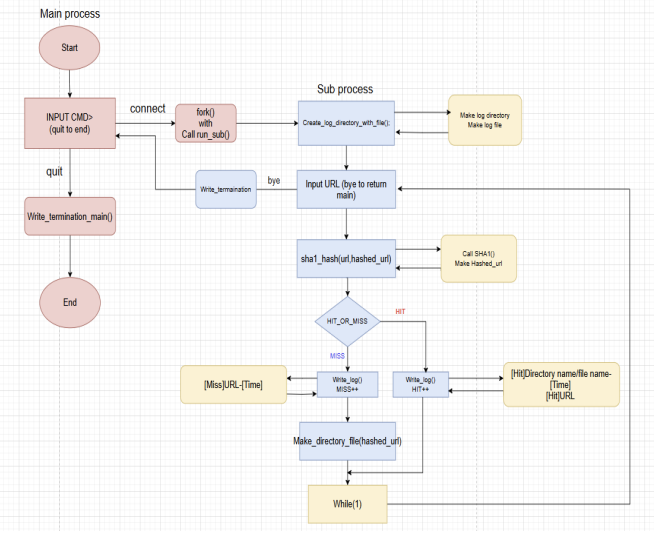
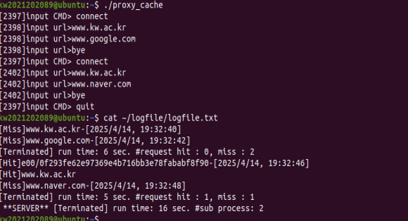

## 1. Introduction

**Proxy 1-2에 이어서 기능 추가**

이전 Proxy1-2에서 구현한 SHA-1 기반 캐싱 시스템에 멀티프로세스 제어 로직을 
추가한 단계입니다. 메인 프로세스(Parent)가 사용자 명령을 관리하고, 실질적인 캐싱
로직은 자식 프로세스(Child)를 생성하여 처리하도록 설계하여 프로세스 간 역할 분담을 구현했습니다.

---

**핵심 구현 기능**
- Main Process Loop
    - connect: fork() 시스템 콜을 호출하여 자식 프로세스를 생성합니다.
    - quit: 전체 서버의 가동 시간 및 생성된 서브 프로세스의 총 개수를 로그파일(logfile.txt)에 기록한 후 프로그램을 안전하게 종료합니다.

- Sub-Process Logic
    - Proxy 1-2의 핵심 기능(URL 해싱, 캐시 디렉토리 조회 및 생성, Hit/Miss 판별)을 수행합니다.
    - bye 입력 시 해당 자식 프로세스만 종료되며, 제어권은 다시 부모 프로세스로 반환됩니다.

- Logging
    - 각 서브 프로세스의 작업 내역(Hit/Miss)뿐만 아니라, 메인 서버의 시작부터 종료까지의 통계 데이터를 관리합니다.

- Key Functions
    - fork(): 멀티프로세스 환경 구축
    - wait(): 자식 프로세스 자원 회수 및 동기화
---

## 2. Flow chart

---

## 3. Pseudo code

- Server Start: umask(0) 설정 및 서버 시작 시간 기록.
- Command Input:

    - connect 입력 → fork() 실행.
    - Child: run_sub() 실행 (URL 입력 및 캐싱 로직 수행) → bye 입력 시 exit(0).
    - Parent: 자식 프로세스의 종료를 wait()하며 대기, 프로세스 카운트 증가.
- Server Termination: quit 입력 시 전체 실행 시간 계산 및 로그 남기기.

## 4. Result

connect 
→ Sub Process에서 proxy 1-2 기능 수행
→ connect
→ Sub Process에서 proxy 1-2 기능 수행
→ quit
→ cat ~/logfile/logfile.txt를 통해 logfile.txt 파일에 기록된 내용확인

## 5. Discussion

이번 과제는 이전에 구현한 Proxy 1-2에 이어서, 사용자 요청 처리를 위해서, 메인 프로세서에서는 CMD (connect, quit)의 명령어를 입력받게하고, 이어서 새로운 자식 프로세서를 생성한 뒤, 자식 프로세서에서는 이전에 구현한 Proxy 1-2의 기능을 그대로 수행하게 하게끔 역할을 분리시키
는 과제였습니다.

처음에는 프로그램 안에서 프로세서를 나눠서 부모 프로세서와 자식 프로세서를 할당한다는 개념이 낯설었는데, 개념 학습을 다시 해보니까, 리눅스에서는 fork() 함수를 사용해서, fork()가 0으로 할당되게 되면 자식 프로세서를 생성하고, 이 생성된 자식 프로세서에서 처리를 하고, 부모 프로세서는 wait()함수를 사용하여, 동작중인 자식 프로세서를 기다릴 수 있다는 것을 알게 되었습니
다.

이번 과제를 진행하면서 logfile.txt 파일에 HIT 로그를 기록하는 과정에서, 깨진 문자가 무한히 출력되는 오류가 발생하였습니다. 문제의 원인은 hit과 miss를 전역 변수로 선언해 놓았기 때문이었습니다. 

이로 인해 이전 서브 프로세스에서 계산된 hit 값이 이후 프로세스에도 남아 있었고, 로그 기록조건문인 if (hit이면)이 항상 참으로 평가되어, 유효하지 않은 hashed_url 값으로 로그가 반복해서 출력되는 현상이 발생하였습니다.

이를 해결하기 위해 hit과 miss 변수를 run_sub() 함수의 지역 변수로 변경하여, 각 프로세스 내에서만 값을 유지하도록 수정하였습니다. 또한, HIT 로그를 작성하는 if문에 hashed_url != NULL 조건을 추가하여, 보다 안전하게 동작하도록 이중으로 체크하였습니다.

---

## 6. Reference

- [fork함수 사용법](https://kim-hoya.tistory.com/7)
- [wait 함수 사용법](https://reakwon.tistory.com/45)