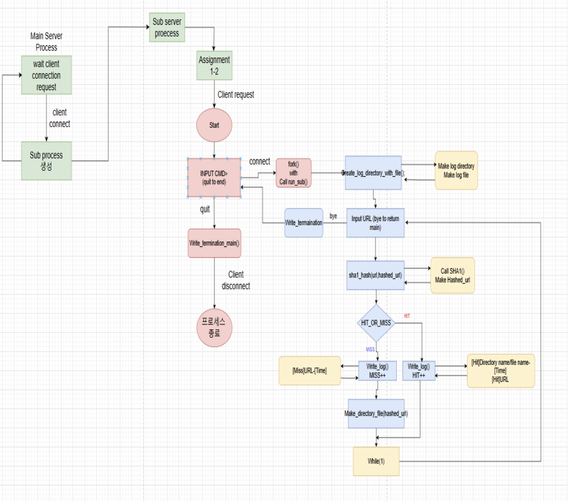
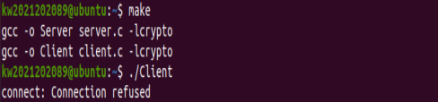
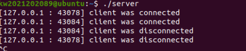
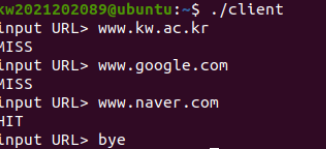
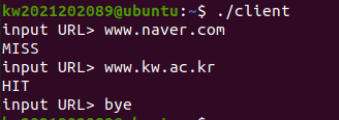
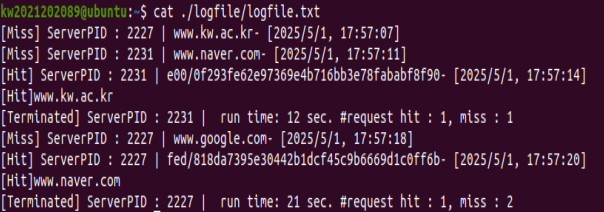

## 1. Introduction

본 프로젝트는 멀티플렉싱 방식이 아니라, `fork()`를 이용한 멀티프로세스 기반의 서버 구조로 구현하였다. 서버는 `accept()`를 통해 클라이언트의 연결 요청을 수락한 뒤, `fork()`를 호출하여 자식 프로세스를 생성한다. 생성된 자식 프로세스는 해당 클라이언트와의 통신을 담당하고, 부모 프로세스는 다시 새로운 클라이언트의 연결을 기다린다. 따라서 여러 클라이언트의 요청을 각각 별도의 프로세스에서 처리할 수 있다.

이번 과제에서는 소스코드를 server.c와 client.c로 분리하여 구현하였다. server.c는 서버 기능을 담당하고, client.c는 클라이언트 기능을 담당한다. 서버는 ./Server 명령어를 통해 실행되며, 실행 후 ./Client를 통해 다수의 클라이언트로부터 URL 요청을 받을 수 있다. 요청을 받은 서버는 메인 서버 프로세스의 하위 프로세스를 생성하여 Proxy 1-2에서 구현한 연산을 수행한다. 또한 로그 파일에는 getpid()를 이용하여 서버 프로세스의 PID와 함께 Terminated 메시지를 기록하도록 구현하였다.


## 2. Flow chart




## 3. Pseudo code

### server.c

1 ) 파일 생성 권한 제한을 없애기 위해 umask(0) 설정

2 ) 서버와 클라이언트 주소 구조체 선언

3 ) 서버 소켓 생성 (IPv4, TCP)

4 ) 실패하면 에러 메시지 출력 후 종료

5 ) 서버 주소 구조체 초기화 및 설정 (127.0.0.1, 지정된 포트)

6 ) 소켓과 주소를 bind 실패 시 에러 메시지 출력 후 종료

7 ) 클라이언트 접속을 대기 상태로 설정 (대기 큐 크기 5)

8 ) 자식 프로세스가 종료되었을 때 좀비 프로세스가 되지 않도록 SIGCHLD 무시

9 ) while

- 클라이언트 접속 수락
- 실패하면 에러 메시지 출력 후 종료
- 자식 프로세스를 생성

    - 자식 프로세스일 경우
        - 서버 소켓 닫기
        - 클라이언트 처리 함수 호출

    - 부모 프로세스일 경우
        - 자식에게 연결 넘기고 클라이언트 소켓 닫기
        - 루프를 빠져나오면 서버 소켓 닫고 프로그램 종료


### client.c
1 ) 소켓 생성

2 ) socket() 호출하여 클라이언트 소켓 생성

3 ) 실패 시 에러 출력 후 종료

4 ) 서버 주소 설정

5 ) server_addr 구조체 설정 (IPv4, 서버 IP: "127.0.0.1", 포트: 40000)

6 ) 서버와 연결 요청
    - connect()로 서버에 연결 시도
    - 실패 시 에러 출력 후 종료

7 ) 사용자로부터 URL 입력 받기 (무한 루프)
- URL을 fgets()로 입력 받음
- 입력받은 URL의 개행 문자 제거 (strcspn())
- 입력받은 URL을 서버에 전송 (write())
- bye입력 시 종료
- "bye" 문자열이 입력되면 루프 종료

8 ) 서버의 응답 받기
- read()로 서버의 응답 읽기
- 응답 출력
- 소켓 닫기

9 ) 클라이언트 소켓 닫기


## 4. Result

make



테스트 케이스 수행







→ 하나의 서버를 실행한 후, 두 개의 클라이언트로부터 요청을 입력받아 서버와 연결한다.

→ 서버는 각 클라이언트로부터 URL 요청을 전달받고, Proxy 1-2에서 구현한 기능을 수행한다.

→ 클라이언트에서 bye를 입력하면 해당 클라이언트와의 연결이 종료된다.



→ /logfile/logfile.txt에 적힌 결과를 확인했을 때, Proxy 1-2의 기능이 잘 수행되었으며, 과제에서 설명한 예제와 마찬가지로 구현된 것을 확인 할 수 있습니다.

## 5. Discussion

이번 과제는 server.c와 client.c를 각각 작성하고, 두 프로그램 사이에서 소켓을 이용하여 간단한 서버-클라이언트 통신을 구현하는 것이었다.
처음에는 실습자료가 있다는 것을 잊고 참고하지 않은 상태로 과제를 진행하였다. 그래서 초반에는 이론 수업에서 다루었던 시험 범위 자료에 포함된 server와 client 관련 코드를 참고하면서 구현을 시작하였다.
구현 과정에서 client.c에서 서버로 URL을 전송하는 부분을 처음에는 다음과 같이 작성하였다.

```c
send(cd, buf, sizeof(buf), 0);
```

그러나 실행 결과 MISS 또는 HIT이 두 번씩 출력되는 문제가 발생하였다. 원인을 찾아보니 sizeof(buf)를 사용하면 실제 입력된 문자열 길이가 아니라 버퍼 전체 크기, 즉 제 코드에서는 1024바이트가 전송되기 때문에 불필요한 데이터까지 함께 전달되어 중복 출력이 발생하였다.

따라서 해당 부분을 다음과 같이 수정하였다
```c
send(cd, buf, strlen(buf), 0);
```

수정 후에는 MISS 또는 HIT이 정상적으로 한 번씩만 출력되도록 문제를 해결할 수 있었다.
이후 뒤늦게 실습자료가 있다는 것을 깨닫고 확인해 보니, 이번 과제와 관련된 서버-클라이언트 통신 코드가 write와 read를 이용하여 비교적 간단하게 작성되어 있었다. 처음부터 실습자료를 참고하지 못한 점이 다소 아쉬웠지만, 이후에는 해당 자료를 참고하여 남은 코드를 완성할 수 있었다.

이번 시스템프로그래밍 수업의 과제들은 2학년 때 수행했던 전공 과제들과 달리, 실습자료에서 과제 해결에 필요한 유용한 정보를 많이 얻을 수 있다는 점을 느꼈다. 따라서 앞으로는 과제를 시작하기 전에 실습자료를 먼저 꼼꼼히 확인하는 습관이 필요하다고 생각하였다.

## 6. Reference
- [소켓 프로그래밍이란](https://tyrionlife.tistory.com/781)