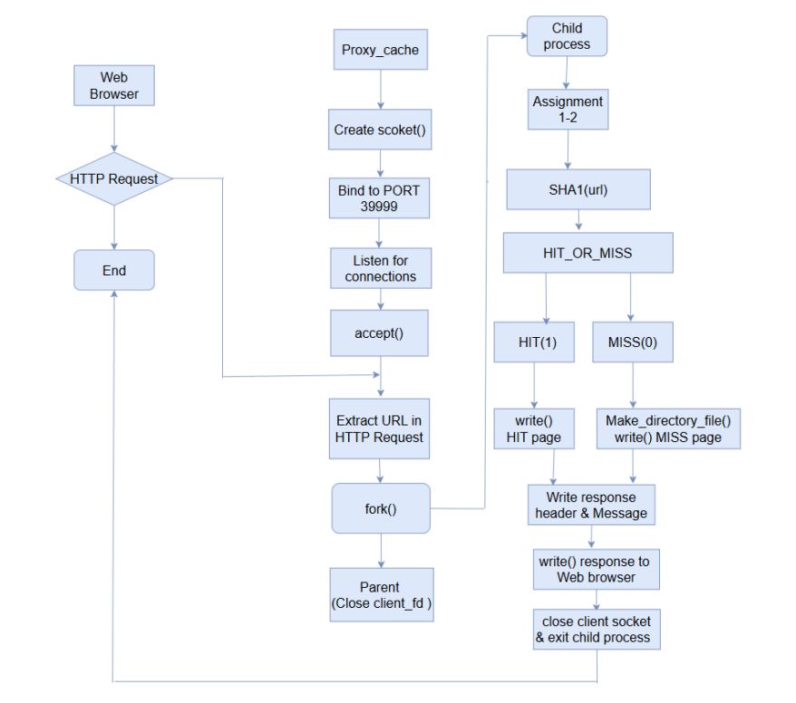
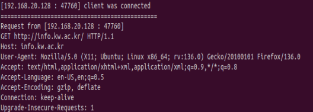
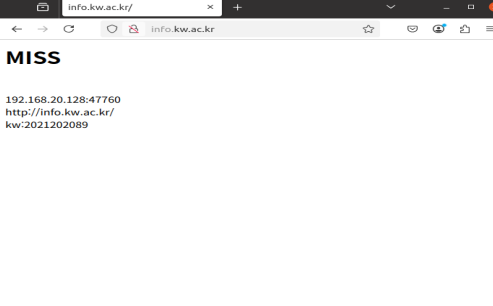
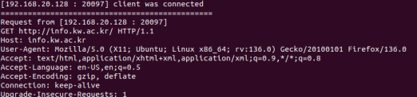
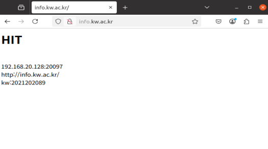
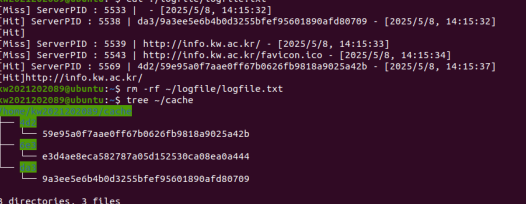
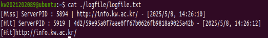

## 1. Introduction

이전 과제에서는 직접 작성한 Client 프로그램과 Server 프로그램 사이에서 요청과 응답을 주고받는 구조를 구현하였다. 반면 이번 과제에서는 Linux 환경에서 Firefox 웹 브라우저를 클라이언트로 사용하고, 사용자가 웹 브라우저에 URL을 입력했을 때 Proxy Server가 해당 HTTP Request를 받아 처리하도록 구현하였다.

프로그램은 command 창에서 `./proxy_cache` 명령어를 입력하여 실행한다. 이후 Firefox 웹 브라우저에서 URL을 입력하면, 웹 브라우저는 Proxy Server로 HTTP Request를 전송한다. Proxy Server는 클라이언트의 연결을 수락한 뒤 Child Process를 생성하고, 해당 Child Process는 HTTP Request Header에서 Host 정보를 추출한다.

이렇게 추출한 Host 정보를 바탕으로 Proxy 1-2에서 구현한 Cache HIT/MISS 판별 기능을 수행한다. 이후 처리 결과에 따라 Response Header와 Response Message를 생성하여 웹 브라우저로 전송하고, 요청 처리가 끝나면 Child Process는 종료된다. 이번 과제에서는 테스트 URL로 광운대학교 홈페이지를 사용하였다.

## 2. Flow chart

## 3. Pseudo code

int main() {
 Set signal handler to prevent zombie processes

 Create socket

 Bind socket to port

 Start listening for client connections

 while (true):
- Accept client connection
- fork()
- if child process:
    - Read HTTP request from client
    - Parse method and URL
    - if method is GET:
        - Hash the URL using SHA1
    - Check if the hashed file exists in
    - if HIT:
        - Build HTTP response with "HIT"
    - else if MISS:
        - Create directories and file based on hashed URL
        - Build HTTP response with "MISS"
        - Send HTTP response headers and Message to client
    - Close client socket
    - Exit child process
- else if parent process:
    - Close client socket (parent doesn’t handle the connection)
- Clean up:
- Close listening socket on termination

## 4. Result

### MISS

→ ./proxy_sever 명령어를 command 창에서 실행하고 , 최초로 info.kw.ac.kr/ 주소를 입력
했을 때 , Cache directory에 해당 url 정보가 없으므로, MISS가 출력됩니다.

### HIT

→ ./proxy_sever 명령어를 command 창에서 실행하고 , 두번째로 info.kw.ac.kr/ 주소를 입
력했을 때 , Cache directory에 해당 url 정보가 존재하여, HIT이 출력됩니다.

### 헷갈리는 출력화면

→ 처음에는 로그파일에 info.kw.ac.kr/ 뿐만 아니라 다른 url도 기록되길래, 코드를
잘못 짰나 했는데, 강의 묻고 답하기를 살펴보니까, “HTML 파일 내의 이미지나
리소스가 브라우저에 의해 캐싱되는 것도 오류가 아닙니다” 라고 나와 있어서,
코드를 잘못 짠 것이 아니라 특성이 그런 것임을 알게 되었습니다.

→ HTTP request는 모두 받게하되, 최종적으로는 요청한 URL에 대해서만, 로그파일
을 기록하게끔 예외처리를 해주었습니다. 

## 5. Discussion

이번 실습 과제는 Linux 환경에서 Firefox 브라우저를 사용해 Proxy Server를 직접 구현해 보는 것이었습니다. 웹 브라우저가 URL을 입력하면 Proxy Server가 HTTP Request를 받아 Host 정보(URL)를 추출하고, 이를 토대로 HIT/MISS를 판별하여 브라우저에 Response Header와 Message를 전송하는 구조였습니다.

강의 시간에 이론으로만 접했을 때는 막연했던 "사용자와 서버 간의 연결 구조"가 직접 과제를 수행하며 코드로 구체화되니 훨씬 깊이 있게 이해되었습니다. 처음에는 Linux 환경에서 코드를 작성하고, Makefile을 빌드하며 생소한 리눅스 라이브러리와 함수들을 처리하는 과정이 다소 복잡하고 낯설었습니다. 하지만 매주 연속해서 과제를 해결해 나가다 보니 점차 손에 익고 개발 프로세스에 적응할 수 있었습니다.

특히 이번 과제가 흥미로웠던 점은 단순한 콘솔 창 입출력 방식에서 벗어나, 응답 메시지를 HTML 형식으로 작성해 웹 브라우저와 직접 상호작용했다는 점입니다. 우리가 평소에 보는 웹사이트들이 사용자와 어떻게 소통하는지 그 뒤편의 원리를 알 수 있는 좋은 경험이었습니다.

과제 수행 중 한 가지 흥미로운 의문점도 생겼습니다. info.kw.ac.kr에 단 한 번 접속했을 뿐인데, 커맨드 창에는 예상보다 훨씬 많은 HTTP 요청들이 찍히는 것을 발견했습니다. 조사를 통해 웹 브라우저가 보안 및 성능 최적화를 위해 백그라운드에서 자동으로 여러 요청을 발생시킨다는 사실을 알게 되었고, 이를 강의 묻고 답하기 게시판을 통해 다시 한번 확인받으며 학습을 마무리할 수 있었습니다.

## 6. Reference
[HTTP persistent connection](https://en.wikipedia.org/wiki/HTTP_persistent_connection)