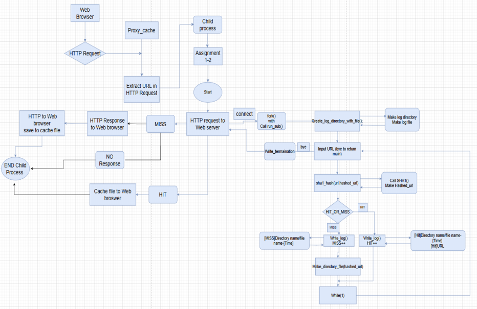
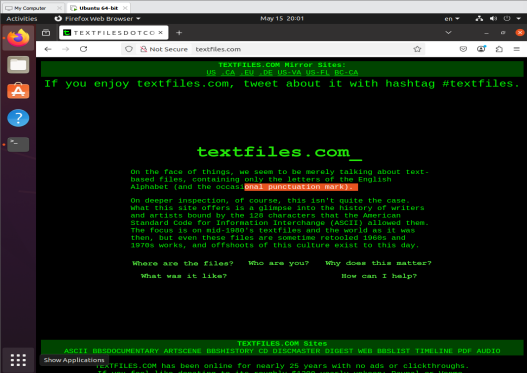
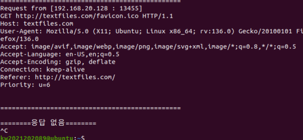

## 1. Introduction
이번 Proxy 2-3 과제는 이전 과제를 기반으로 진행됩니다. Parent process는 웹 브라우저로부터의 연결을 대기하고, 프록시 서버가 웹 브라우저와 연결되면 fork()를 사용하여 Child process를 생성합니다. 이후 Parent process는 다시 웹 브라우저의 연결을 대기하고, Child process는 웹 브라우저로부터 HTTP request를 전달받습니다.

Child process는 HTTP request header에서 웹 서버의 주소를 추출한 뒤, 해당 주소를 기준으로 Cache file에 HIT 또는 MISS 정보를 저장합니다. 이전 과제에서는 HIT, MISS 결과에 대한 Response를 웹 브라우저에 출력하는 것이 주요 기능이었다면, 이번 과제에서는 웹 브라우저로부터 받은 HTTP request 내용을 그대로 출력해야 하는 것입니다.

또한 signal() 함수를 사용하여, 웹 서버에 HTTP request를 전달한 후 10초 동안 HTTP response를 받지 못할 경우 응답 없음 메시지를 출력하고 Child process를 종료하는 기능도 구현해야 합니다. 이를 위해 Host name으로부터 network host entry를 가져오는 gethostbyname() 함수가 필요할 것으로 생각됩니다.

## 2. Flow chart

## 3. Pseudo code

Initialize:

- Set hit/miss counters to 0

- Register SIGCHLD handler

- Create, bind, and listen on a socket

While true:
- Accept client connection
- Fork a new child process

 In child process:
 - Read HTTP request from browser
 - Parse method and URL
 - Hash the URL (SHA1)
 - Check cache (HIT or MISS)
    - If HIT
        - Log if not already logged
        - Read cached file and send to browser
    - If MISS
        - Create cache directories
        - Extract host and path from URL
 - Set alarm for timeout
 - Connect to web server
 - Send GET request
 - Receive response, send to browser, and save to cache
 - Close connection and exit child
 In parent process:
- Close client socket and loop
- Close main server socket

## 4. Result

→ 정상적으로 웹 브라우저와 웹 서버간에 HTTP request와 HTTP response가 서로 전달된 것을 확인할 수 있습니다.

→ 해당 화면은 임의로 인터넷 연결을 차단시킨 후, 10초동안 HTTP request를 받지 못
하여 , signal()함수를 사용하여서, 응답없음 메시지가 출력된 화면입니다.

## 5. Discussion
이번 과제는 Proxy server를 사용하여 웹 브라우저와 웹 서버 사이의 HTTP 통신을 처리하는 과제였습니다. 먼저 웹 브라우저가 웹 서버로 HTTP request를 전달하면, Web server는 이를 처리하여 HTTP response를 Web browser에 전달합니다. 이와 동시에 /home/cache 경로에 response data를 저장하도록 구현해야 했습니다. 추가로 인터넷 연결을 임의로 끊었을 때 signal() 함수를 사용하여 SIGCHLD, SIGALRM에 대한 시그널 처리를 수행하는 것도 과제의 주요 내용이었습니다.

처음에는 과제 설명과 실습 자료를 보면서 코드를 작성했을 때, 이번 과제는 비교적 간단하게 끝낼 수 있을 것이라고 생각했습니다. 하지만 몇 시간이 지난 후, 그 생각이 얼마나 성급한 판단이었는지 깨닫게 되었습니다.

처음에는 코드를 빠르게 완성한 뒤 실행해 보았습니다. 웹 브라우저에 HTTP response가 정상적으로 전달되어 출력되는 것을 보고 “잘 나오네”라고 생각했고, 이후 시그널 처리 부분을 구현하려고 했습니다. 그래서 실습 자료를 참고하여 alarm() 함수와 signal() 함수를 사용한 코드를 작성했습니다. 이후 다시 웹 브라우저와 웹 서버 간의 통신을 실행하고, 의도적으로 인터넷 연결을 끊어 보았습니다. 그러나 한참을 기다려도 응답 없음 메시지가 출력되지 않았습니다.

처음에는 “내가 인터넷 연결을 너무 늦게 끊었나?”라고 생각하여, 이번에는 더 빠르게 인터넷 연결을 끊고 다시 실행해 보았습니다. 하지만 이번에도 마찬가지로 응답 없음 메시지는 출력되지 않았습니다. 이 문제를 해결하기 위해 상당히 많은 시간을 소모했는데, 지금 생각해 보면 원인을 정확히 파악하지 못한 채 여러 번 반복 실행하면서 시간을 많이 낭비했던 것 같습니다.

결국 문제의 원인을 파악하고 해결할 수 있었습니다. 첫 번째 원인은 Firefox의 History를 제대로 삭제하지 않았던 것이었습니다. 두 번째 원인은 alarm(10)과 alarm(0)을 처리하는 부분의 코드가 올바르게 작성되지 않았던 것이었습니다. 특히 alarm() 함수는 read() 함수와 밀접한 관련이 있는데, 이를 제대로 고려하지 않은 채 코드를 작성했던 것이 문제였습니다.

이번 과제는 처음에는 간단해 보였지만, 실제로는 가장 시간이 오래 걸리고 어렵게 느껴졌던 과제였습니다. Proxy 2-3을 수행할수록 오히려 더 헷갈리는 부분도 많았습니다. 그래도 강의 묻고답하기 게시판에 이번 과제와 관련된 정보들이 추가로 올라와 있어서, 문제를 이해하고 해결하는 데 많은 도움이 되었습니다.

## 6. Reference