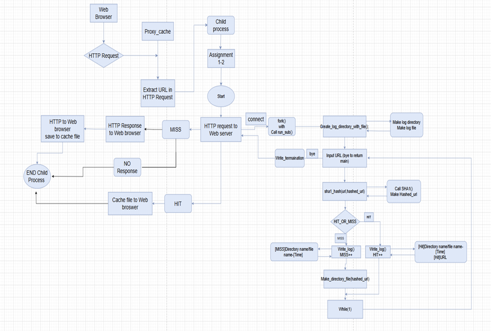
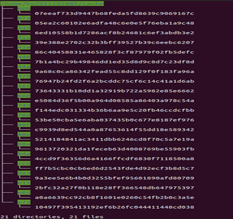
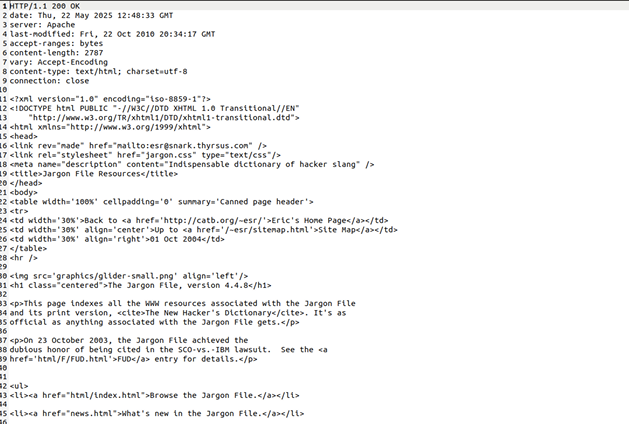
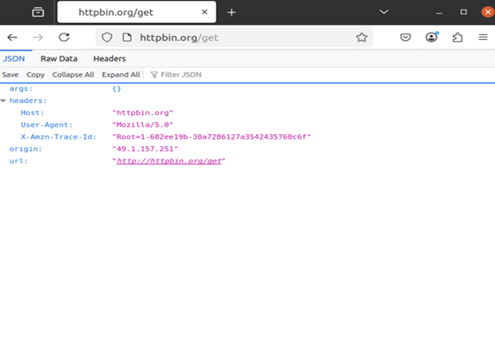
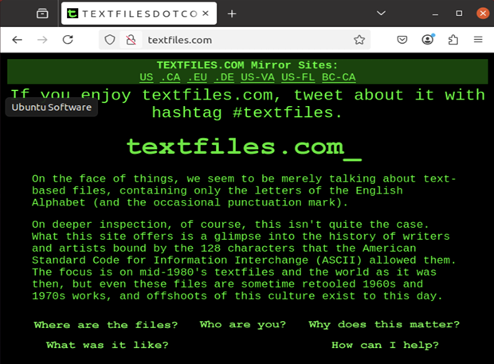
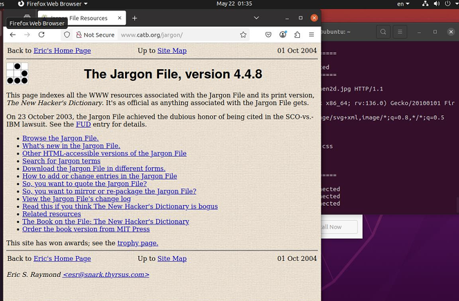
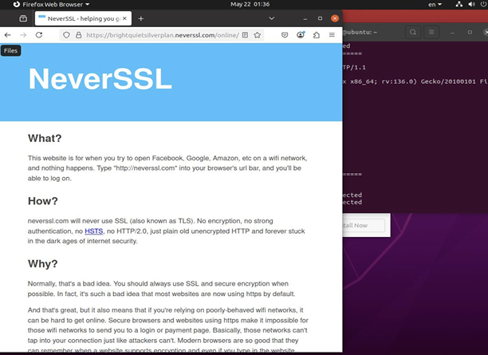
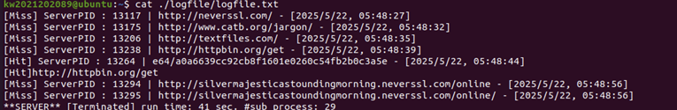

## 1. Introduction
번 과제는 이전 Proxy 2-3 과제의 기능을 확장하는 형태로 진행됩니다. 프록시 서버는 웹 브라우저로부터 연결 요청을 수신하고, 연결이 이루어지면 Child process를 생성하여 HTTP request를 처리합니다. Child process는 request header에서 웹 서버의 URL을 추출한 후, 해당 URL을 해시하여 각 URL에 대한 Cache를 생성합니다.

생성된 Cache 정보를 바탕으로 입력된 URL이 기존에 저장된 Cache와 일치하는지 확인하고, HIT 또는 MISS 여부를 판별하여 그 결과를 logfile에 기록합니다. 또한 사용자가 Ctrl + C를 입력하면 SIGINT 신호가 발생하며, 이를 처리하여 프록시 서버가 정상적으로 종료되도록 구현합니다. 서버 종료 시에는 전체 실행 시간과 총 처리한 Child process의 개수도 함께 logfile에 기록합니다.

Signal 처리 방식에는 default, ignore, catch가 있으며, 이번 과제에서는 catch 방식을 사용합니다. 이를 위해 별도의 Signal handler function을 작성하고, 해당 함수에서 SIGINT 신호를 감지하여 종료 처리와 로그 기록을 수행하도록 구현할 것입니다.

## 2. Flow chart


## 3. Pseudo code

```text
SET Register SIGALRM handler 
SET Register SIGCHLD handler 
SET Register SIGINT handler 
Create, bind, and listen on a socket 

While true: 
   Accept client connection 
   Fork a new child process 

    In child process: 

        Read HTTP request from browser 
        Parse method and URL 
        Hash the URL (SHA1) 
        Check cache (HIT or MISS) 

     If HIT 

            Log if not already logged 
            Read cached file and send to browser 

     If MISS 

            Create cache directories 
            Extract host and path from URL 
            Set alarm for timeout 
            Connect to web server 
            Send GET request 
            Receive response, send to browser, and save to cache 
            Close connection and exit child 
            

    In parent process: 

        Close client socket and loop 

Close main server socket 
```


## 4. Result


→  cache directories가 형성된 것을 확인할 수 있습니다.



→ cache directories 중 아무 캐시 파일을 확인 했을 때, response data가 작성된 것을 확인할 수 있습니다.



→ http://httpbin.org/get를 입력했을 때, 프록시 서버로부터 받은 response message가 정상
적으로 출력된 화면입니다. 



→ http://textfiles.com를 입력했을 때,프록시 서버로부터 받은 response 
message가 정상적으로 출력된 화면입니다. 



→ http://www.catb.org/jargon/를 입력했을 때 , 프록시 서버로부터 받은 response message가 정상적으로 출력된 화면입니다. 



→ http://neverssl.com/ 를 입력했을 때, 프록시 서버로부터 받은 response message가 정상적으로 출력된 화면입니다. 



→ logfile.txt에 hit/miss 및 작동시간과 자식 프로세스 수에 대한 종료 문구가 작성된 것을 확인할 수 있습니다

## 5. Discussion
이번 과제는 이전에 구현한 Proxy 2-3을 바탕으로, SIGINT 신호를 처리하는 기능을 추가하는 과제였습니다. Signal handler function을 활용하여 사용자가 Ctrl + C를 입력했을 때 발생하는 SIGINT 신호를 catch하도록 구현했습니다.

또한 웹 브라우저로부터 입력받은 URL의 HTTP request에 대해 hash function을 적용하고, 그 결과를 바탕으로 Cache 파일에 저장되도록 구현했습니다. 이전에 생성된 Cache 파일을 기준으로 입력된 URL이 Cache file에 존재하면 HIT을 logfile.txt에 기록하고, 존재하지 않으면 MISS를 기록하도록 했습니다.

그리고 SIGINT 신호가 catch될 경우 프로그램이 종료되며, 이때 전체 실행 시간과 생성된 Child process의 총 개수도 함께 logfile.txt에 기록되도록 구현했습니다.

이번 과제를 수행하면서 궁금했던 점은 logfile.txt의 마지막 줄에서 확인할 수 있는 Child process의 개수였습니다. 처음에는 생각보다 많은 Child process가 생성되어, 왜 이렇게 많은 프로세스가 만들어지는지 궁금했습니다.

이를 확인하기 위해 디버그 메시지를 추가하여 검증해 보았습니다. 그 결과, 웹 브라우저는 한 번의 접속에서도 여러 개의 요청을 보내는 것을 확인할 수 있었습니다. 예를 들어 하나의 웹 페이지를 불러올 때 HTML뿐만 아니라 CSS, 이미지, JavaScript 파일 등 여러 리소스에 대한 요청이 함께 발생합니다. 이 각각의 요청은 개별 HTTP request로 처리되며, Proxy server는 각 요청마다 fork()를 수행하여 Child process를 생성합니다.

따라서 Child process의 개수가 많게 나타난 이유는 브라우저가 여러 리소스를 비동기적으로 병렬 요청하기 때문이라는 것을 알 수 있었습니다.

이번 과제를 통해 웹 브라우저와 Proxy server 간의 연결 및 요청 처리 과정을 직접 다룰 수 있었습니다. 또한 여러 테스트 사이트를 이용해 검증해 보면서, MISS일 때보다 HIT일 때 응답 속도가 확실히 더 빠르다는 것을 체감할 수 있었습니다. 이를 통해 Cache가 실제 웹 요청 처리 성능에 어떤 영향을 주는지도 이해할 수 있었습니다.

## 6. Reference