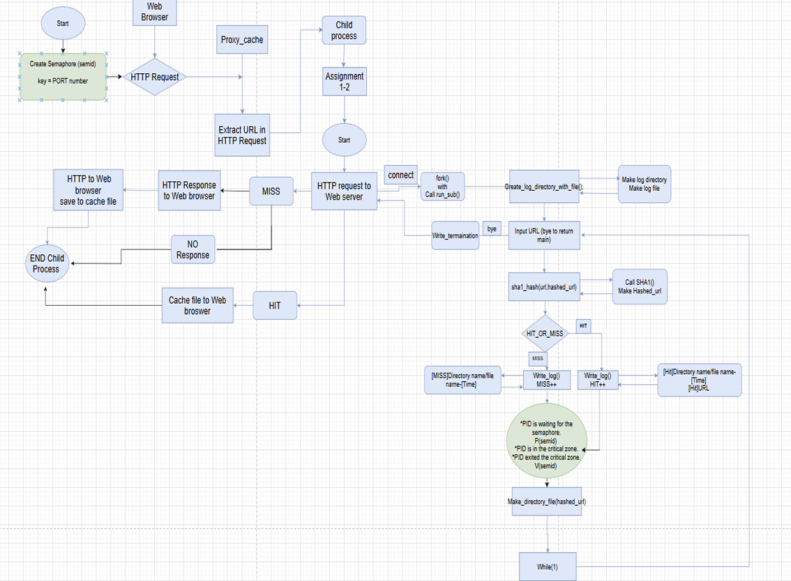
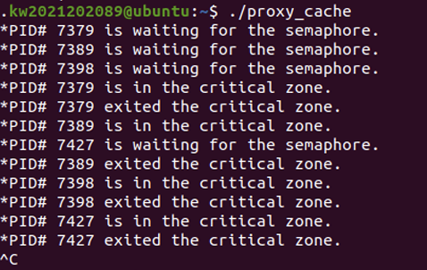

## 1. Introduction
이번 Proxy 3-1 과제는 logfile에 대한 동시 접근을 제어하기 위해 Semaphore를 활용하는 것입니다. 이전 과제에서 구현한 프록시 서버에 Semaphore를 추가하여 한 번에 하나의 프로세스만 로그를 기록할 수 있도록 수정합니다. 
주의해야할 점으로는 Semaphore의 key는 포트 번호와 동일하게 설정해야합니다. 그리고 Critical Section 상태를 터미널에 출력하여 동시 접근 상황을 실시간
으로 확인할 수 있도록 합니다. 
이는 sleep()을 이용해 접근 시점을 조절하여 여러 프로세스가 로그파일을 동시에 접근하는 상황을 확인할 수 있습니다. 

## 2. Flow chart


## 3. Pseudo code

```text
initialize server socket (bind, listen) 
create semaphore with key = PORT 

loop: 
       accept client connection 
       fork process 

if child process: 
       handle_client() 
       exit 
else: 
       close client socket (in parent) 

-------------------------------------------------- 

handle_client(): 
       read HTTP request from client 
       parse URL 
       hash URL to create hashed_path 
       if cache exists for hashed_path: 
              send cached response to client 
              write_log_in_file(url, hashed_url, "Hit") 
       else: 
              connect to original web server 
              fetch response 
              cache response 
              send to client 
              write_log_in_file(url, hashed_url, "Miss") 
close client connection 

-------------------------------------------------- 

write_log_in_file(url, hashed_url, type): 
       sleep for 0.1 seconds  // to simulate concurrent access 
       print "PID is waiting for the semaphore" 
       P(semid)  // acquire semaphore 
       print "PID is in the critical zone" 
       open logfile in append mode 
       get current time 

       if type == "Hit": 
              write [Hit] log 

       else if type == "Miss": 
              write [Miss] log 

       sleep for 1 second  // stay in critical zone 

       print "PID exited the critical zone" 
close logfile 
V(semid)  // release semaphore 

-------------------------------------------------- 

P(semid): perform semaphore wait (down operation) 
V(semid): perform semaphore signal (up operation) 
```


## 4. Result


→ Semaphore를 사용하여, 동시에 여러 프로세스가 접근했을 때,  sleep()을 사용하여, Critical section 내에 프로세스들이 동시 접근하는 경우가 잘 이루어짐을 알 수 있습
니다.

## 5. Discussion
Proxy 3-1 과제를 통해 다중 프로세스 환경에서 발생할 수 있는 race condition 문제를 경험하고, 이를 해결하기 위한 세마포어(Semaphore) 기반 동기화 기법을 실습할 수 있었다.

특히 logfile과 같은 공유 자원을 다룰 때, 적절한 접근 제어를 하지 않으면 데이터 충돌이나 손상이 발생할 수 있다는 점을 실제로 확인할 수 있었다. 세마포어를 사용하여 한 번에 하나의 프로세스만 로그 파일에 접근하도록 함으로써, 동기화의 중요성과 효과를 직접 체험할 수 있었다.

출력 결과를 통해 각 프로세스가 언제 대기하고, 언제 critical zone에 진입하며, 언제 작업을 종료하는지를 시각적으로 확인할 수 있었던 점이 인상 깊었다. 또한 sleep() 함수를 활용하여 여러 프로세스가 동시에 접근하는 상황을 시뮬레이션함으로써, 시스템 프로그래밍 이론 시간에 배운 동기화 개념을 실제 코드로 구현해 볼 수 있었다.

이번 과제를 통해 세마포어의 P 연산은 자원을 잠그는 lock 역할을 하고, V 연산은 자원을 해제하는 unlock 역할을 한다는 점을 코드 흐름 속에서 이해할 수 있었다. 이를 통해 시스템 프로그래밍에서 프로세스 간 자원 관리가 얼마나 중요한지 다시 느낄 수 있었다.

과제를 진행하기 전에는 세마포어 개념이 다소 추상적으로 느껴졌지만, 직접 구현해 보니 왜 필요한지 확실히 알 수 있었다. 여러 프로세스가 동시에 로그 파일에 접근하려고 할 때 출력이 꼬이거나 충돌할 수 있다는 점을 보면서, 동기화의 필요성을 체감할 수 있었다.

처음에는 fflush()나 세마포어 관련 함수들도 생소했지만, 과제를 진행하면서 하나씩 이해해 가는 과정이 흥미로웠다. 단순히 코드를 작성하는 것을 넘어, 시스템 자원을 안전하게 관리하는 방식까지 고민해 볼 수 있었고, 여러 프로세스 간의 동시 접근 문제에 대해 더 잘 이해하게 되었다.

## 6. Reference