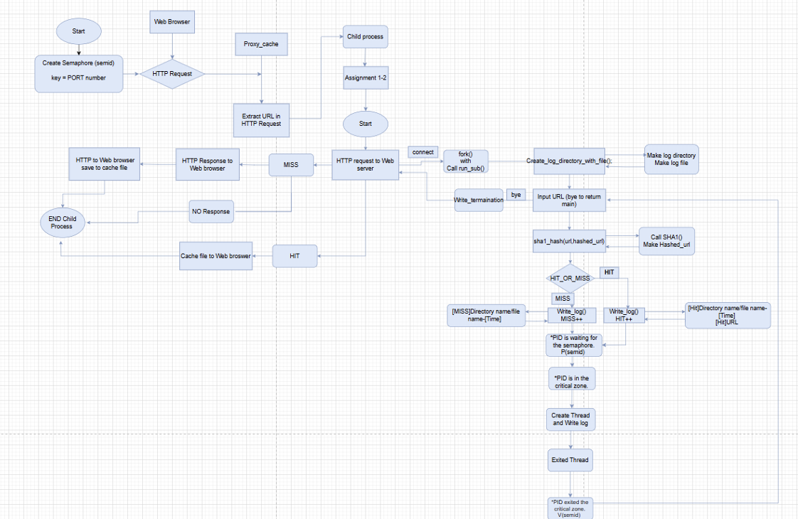
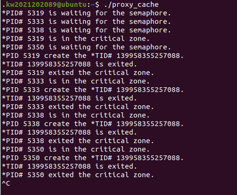
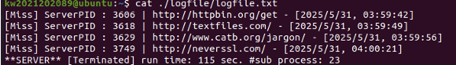

## 1. Introduction
마지막 과제인 Proxy 3-2 에서는, 이전에한 Proxy 3-1 과제에 Critical section 내에서 log를 기록하
는 thread를 추가하는 과제이다. (이때 쓰레드란 프로세스 내에서 실제로 작업을 수행하는 주체를 
의미하는데, 모든 프로세스는 한 개 이상의 쓰레드가 존재하여 작업을 수행하게 된다.)  그리고 
할당된 thread내에서 어떤 자식 프로세스가 스레드를 생성한지를 알 수 있게끔, 터미널상에서 자
식 프로세스와 해당 프로세스에서 생성된 스레드의 ID를 출력한다. 또한 스레드가 종료될 때는 
해당 id를 가진 스레드가 종료되는 것을 알려주기 위해서, 터미널에 스레드 종료 메시지를 출력한
다. 또한 이번 과제에서는 캐시 락 경쟁 문제를 고려하지 않으므로, 캐시 파일을 동시에 접근해서 
생기는 문제는 고려하지 않아도 된다.

## 2. Flow chart


## 3. Pseudo code
```text
initialize server socket (bind, listen) 
create semaphore with key = PORT 
loop forever: 
       accept client connection 
       fork process 
       if child process: 
              handle_client() 
              exit 
       else: 
              close client socket (in parent) 

-------------------------------------------------- 

handle_client(): 
       read HTTP request from client 
       parse URL 
       hash URL to create hashed_path 
       if cache exists for hashed_path: 
              send cached response to client 
              Write_log_in_file(url, hashed_url, "Hit") 
       else: 
              connect to original web server 
              fetch response 
              cache response 
              send to client 
              Write_log_in_file(url, hashed_url, "Miss") 
       close client connection 
       
-------------------------------------------------- 

Write_log_in_file(url, hashed_url, type): 
       sleep  
       print "*PID is waiting for the semaphore" 
       P(semid)  // acquire semaphore 
       print "*PID is in the critical zone" 
       Create Thread 
       Print “*PID# getpid() create the *TID# pthread_ID” 
       open logfile in append mode 
       get current time 
       if type == "Hit": 
       write [Hit] log 
       else if type == "Miss": 
       write [Miss] log 
       Exited Thread with print Exited message 
       sleep  
       print "*PID exited the critical zone" 
       close logfile 
       V(semid)  // release semaphore 
       
-------------------------------------------------- 

```


## 4. Result


→ 이전에 Proxy 3-1 에서 구현한 Semaphore 동기화가 마찬가지로 잘 이루어짐을 알 수 있습니다. 또한 Critical section에 진입한 해당 프로세스에서 thread가 형성되어서, log file을 작성하고, 스레드가 종료된 뒤 Critical section또한 해제됨을 알 수 있습니다. 


→ 로그 파일도 이전 Proxy 3-1의 기능과 동일하게 기록됨을 알 수 있습니다

## 5. Discussion
마지막 Proxy 3-2 과제는 Critical Section 내에서 로그를 기록하는 Thread를 추가하는 것이었습니다. 기존 Proxy 3-1에서 구현한 로그 기록 함수를 크게 수정하지 않고, 이를 Thread로 분리하는 과정을 통해 pthread의 사용법을 익힐 수 있었습니다.

특히 pthread_create(), pthread_join() 등의 함수를 사용하면서 Thread 생성과 종료 방식, Thread 간 자원 공유, 그리고 동기화 개념을 자연스럽게 이해할 수 있었습니다.

이번 과제에서는 세마포어로 보호되는 Critical Section 안에서 Thread를 생성하고, Proxy 3-1과 동일하게 로그를 남기도록 구현하는 것이 중요했습니다. 이를 위해 로그가 출력되는 시점과 Thread가 종료되는 시점을 명확히 구분하고, 관련 메시지가 정확히 출력되도록 구현했습니다.

처음에는 TID가 의도한 대로 출력되지 않아 syscall(SYS_gettid)를 사용하는 등의 시행착오도 있었습니다. 하지만 최종적으로 Thread가 정상적으로 생성되고 종료되며 로그를 남기는 흐름을 구현하면서, 병렬 처리와 동기화의 중요성을 체감할 수 있었습니다.

또한 이론 시간에 배웠을 때는 Process와 Thread의 관계가 다소 헷갈렸지만, 이번 과제를 통해 Thread는 Process 내부에서 실행되는 작업 단위라는 점을 더 명확히 이해할 수 있었습니다.

이렇게 이번 학기 시스템 프로그래밍 과제를 모두 마치게 되었습니다. 처음 Proxy server에 대해 배웠을 때는 개념이 막연하게 느껴졌고, Linux 사용도 익숙하지 않아 헷갈리는 부분이 많았습니다. 하지만 주기적인 과제를 수행하면서 수업 시간에 배운 내용을 계속해서 복습하고 실제로 구현해 볼 수 있었기 때문에, 시스템 프로그래밍 개념을 보다 효율적으로 학습할 수 있었던 것 같습니다.

## 6. Reference